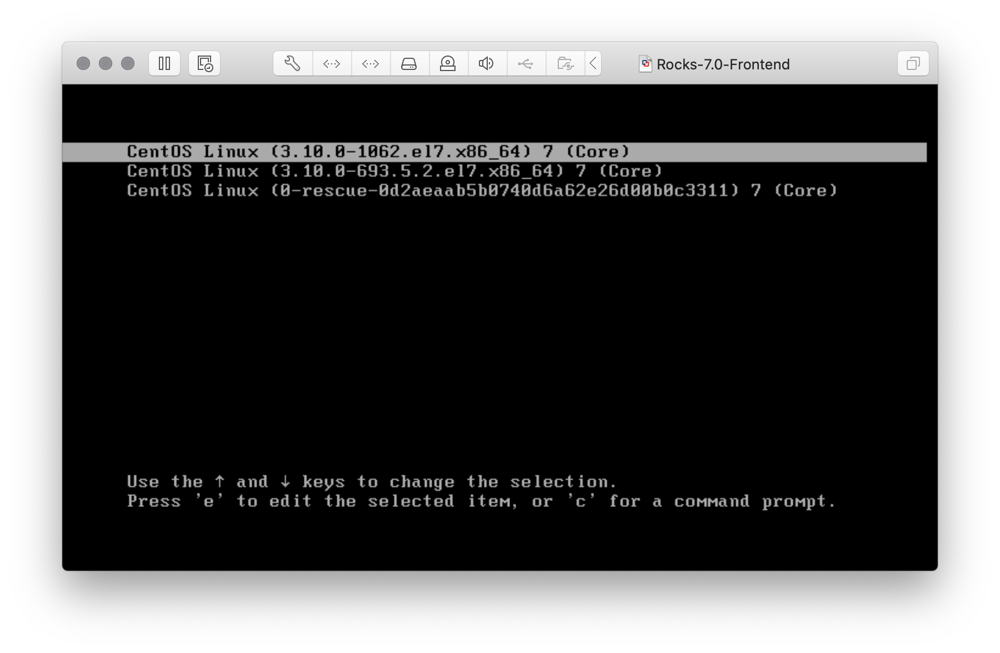
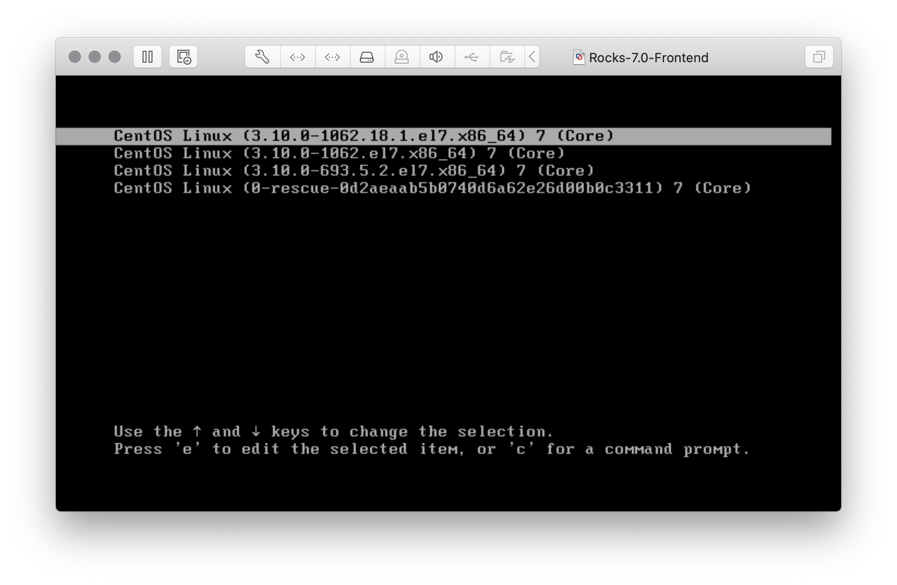

# Cluster Install from Scratch

A little log of installing a brand new cluster from scratch with all updates and tweaks.

All the procedures outlined in this document have been extensively tested on a virtualized cluster using VMWare Fusion 11.5.3 running on an 2017 MacBook Pro. Use it on your own risk.

Last edited: 2020-04-10

------

## Step 1 - Plain Vanilla Installation of Rocks 7.0

1. Download original [kernel roll](http://central-7-0-x86-64.rocksclusters.org/isos/kernel-7.0-0.x86_64.disk1.iso) and boot frontend with it. In case you run into driver problems try the alternative [updated kernel roll](http://central-7-0-x86-64.rocksclusters.org/isos/testing/kernel-7.0-2.x86_64.disk1.iso).
2. Configure cluster to your needs. Closely follow the instructions in http://central-7-0-x86-64.rocksclusters.org/roll-documentation/base/7.0/install-frontend-7.html.
3. Select rolls for usage, for example you may choose `base`, `core`, `kernel`, `CentOS-7.4.1708`, `Updates-CentOS-7.4.1708`, `ganglia`, `sge`, `yumfix`. 
4. Kick-off frontend-node installation and lean back. Downloading all the rolls takes some time, as long as you haven't created a mirror [roll-server](https://github.com/rocksclusters/roll-server) nearby.

Unfortunately only network installation is possible at this time.

## Step 2 - Upgrade / Update towards CentOS 7.7

So now you have a working frontend node with a CentOS 7.4 software installation baselined in [September 2017](https://lists.centos.org/pipermail/centos-announce/2017-September/022532.html). As long as there is no new Rocks X.Y based on CentOS 8 or whatever (and probably there will be [no major update](https://marc.info/?l=npaci-rocks-discussion&m=158481906006702&w=2) in the foreseeable future) the least you can do is to upgrade everything up to CentOS 7.7 status.

The key is to create a new CentOS roll and a new Update-CentOS roll. The following procedure is based on:

- http://central-7-0-x86-64.rocksclusters.org/roll-documentation/base/7.0/update.html
- https://marc.info/?l=npaci-rocks-discussion&m=157077535409824&w=2

Choose a CentOS-mirror next to you.

```bash
cd /root
mkdir centos-7-7 && cd centos-7-7
mirror=http://ftp.hosteurope.de/mirror/centos.org
osversion=7.7.1908
rocks create mirror ${mirror}/${osversion}/os/x86_64/Packages/ rollname=CentOS-${osversion}
```

This creates a new ISO-image called...

```bash
-rw-r--r-- 1 root root 10416445440  1. Apr 21:58 CentOS-7.7.1908-7.0-0.x86_64.disk1.iso
```

Then create a new Updates-CentOS roll:

```bash
cd /root
mkdir centos-7-7-update && cd centos-7-7-update
mirror=http://ftp.hosteurope.de/mirror/centos.org
osversion=7.7.1908
version=`date +%F`
rocks create mirror ${mirror}/${osversion}/updates/x86_64/Packages/ rollname=Updates-CentOS-${osversion} version=${version}
```

This results in an update ISO-image comprising all updates as of your current date.

```
Updates-CentOS-7.7.1908-2020-04-01-0.x86_64.disk1.iso
```

Now have a look at the list of rolls currently available on your frontend-node:

```bash
[root@host ~]# rocks list roll
NAME                     VERSION    ARCH   ENABLED
base:                    7.0        x86_64 yes    
CentOS:                  7.4.1708   x86_64 yes    
core:                    7.0        x86_64 yes    
ganglia:                 7.0        x86_64 yes    
kernel:                  7.0        x86_64 yes    
sge:                     7.0        x86_64 yes    
Updates-CentOS-7.4.1708: 2017-12-01 x86_64 yes    
yumfix:                  7.0        x86_64 yes    
[root@host ~]# 
```

There you see the old OS-related rolls `CentOS` and `Updates-CentOS-7.4.1708`. These are the rolls we would like to upgrade and update. 

Now add both new created ISO-images to your rocks installation. The roll content will be copied effectively to `/export/rocks/install/rolls`.

```bash
rocks add roll CentOS-7.7.1908-7.0-0.x86_64.disk1.iso
rocks add roll Updates-CentOS-7.7.1908-2020-04-01-0.x86_64.disk1.iso
```

Both new rolls are added but not yet activated:

```bash
[root@host ~]# rocks list roll
NAME                     VERSION    ARCH   ENABLED
base:                    7.0        x86_64 yes    
CentOS:                  7.4.1708   x86_64 yes    
core:                    7.0        x86_64 yes    
ganglia:                 7.0        x86_64 yes    
kernel:                  7.0        x86_64 yes    
sge:                     7.0        x86_64 yes    
Updates-CentOS-7.4.1708: 2017-12-01 x86_64 yes    
yumfix:                  7.0        x86_64 yes    
CentOS-7.7.1908:         7.0        x86_64 no     
Updates-CentOS-7.7.1908: 2020-04-01 x86_64 no     
[root@host ~]#
```

Now activate the `CentOS-7.7.1908` roll and launch the OS upgrade from CentOS 7.4 to CentOS 7.7:

```
rocks enable roll CentOS-7.7.1908
cd /export/rocks/install
rocks create distro
yum clean all
yum update
```

Typically more than 1000 packages will be updated. When done reboot the frontend to make the upgrade effective.  You will notice that there is a new entry in the boot menu:

Once the frontend-node is ready again, proceed with applying the updates to CentOS 7.7:

```
rocks enable roll Updates-CentOS-7.4.1708
cd /export/rocks/install
rocks create distro
yum clean all
yum update
```

Much less packages will be updated. When done reboot the frontend to make the update effective.  You will notice again that there is another new entry in the boot menu:



Once the frontend-node is operational again, you can check finally if really all currently available updates to CentOS 7.7 have been applied:

```bash
[root@host ~]# yum --enablerepo=updates check-updates
Loaded plugins: fastestmirror, langpacks
Loading mirror speeds from cached hostfile
 * updates: centos.intergenia.de
[root@host ~]#
```

The list is empty, no updates available. 👌🏻 Now remove the old CentOS 7.4 rolls to save some disk space by:

```bash
rocks disable roll Updates-CentOS-7.4.1708
rocks disable roll CentOS
rocks remove roll Updates-CentOS-7.4.1708
rocks remove roll CentOS
cd /export/rocks/install
rocks create distro
```

Your list of installed rolls could now look like this:

```bash
[root@host install]# rocks list roll
NAME                     VERSION    ARCH   ENABLED
base:                    7.0        x86_64 yes    
core:                    7.0        x86_64 yes    
ganglia:                 7.0        x86_64 yes    
kernel:                  7.0        x86_64 yes    
sge:                     7.0        x86_64 yes    
yumfix:                  7.0        x86_64 yes    
CentOS-7.7.1908:         7.0        x86_64 yes    
Updates-CentOS-7.7.1908: 2020-04-01 x86_64 yes    
[root@host install]#
```

That's it. CentOS 7.4 is gone finally.💪🏻 If you like you can remove the unnecessary older kernel packages:

```bash
yum remove kernel-devel-3.10.0-693.5.2.el7.x86_64 kernel-3.10.0-693.5.2.el7.x86_64 kernel-devel-3.10.0-1062.el7.x86_64 kernel-3.10.0-1062.el7.x86_64
```

You can keep your frontend node and your compute-nodes up-to-date by periodically creating a new update roll with ...

```bash
cd /root
mkdir centos-7-7-update && cd centos-7-7-update
mirror=http://ftp.hosteurope.de/mirror/centos.org
osversion=7.7.1908
version=`date +%F`
rocks create mirror ${mirror}/${osversion}/updates/x86_64/Packages/ rollname=Updates-CentOS-${osversion} version=${version}
```

... where the date `<YYYY-MM-DD>` in the ISO-filename

```
Updates-CentOS-7.7.1908-<YYYY-MM-DD>-0.x86_64.disk1.iso
```

discriminates to the previous update roll.

## Step 3 - Way ahead

Once you have the new rolls `CentOS-7.7.1908` and `Updates-CentOS-7.7.1908` in your hands you can use them directly in a new cluster install without the old OS rolls supplied with CentOS 7.4. If your `Updates-CentOS-7.7.1908`  roll is recent enough your cluster will feature from the start all the newest stuff (e.g. kernel, compiler, etc), like this:

```bash
[root@frontend-0-0 ~]# rocks list roll
NAME                     VERSION    ARCH   ENABLED
base:                    7.0        x86_64 yes    
CentOS-7.7.1908:         7.0        x86_64 yes    
core:                    7.0        x86_64 yes    
ganglia:                 7.0        x86_64 yes    
kernel:                  7.0        x86_64 yes    
sge:                     7.0        x86_64 yes    
Updates-CentOS-7.7.1908: 2020-04-01 x86_64 yes    
yumfix:                  7.0        x86_64 yes    
[root@frontend-0-0 ~]# uname -a
Linux frontend-0-0.corp 3.10.0-1062.18.1.el7.x86_64 #1 SMP Tue Mar 17 23:49:17 UTC 2020 x86_64 x86_64 x86_64 GNU/Linux
[root@frontend-0-0 ~]# gcc --version
gcc (GCC) 4.8.5 20150623 (Red Hat 4.8.5-39)
Copyright (C) 2015 Free Software Foundation, Inc.
This is free software; see the source for copying conditions.  There is NO
warranty; not even for MERCHANTABILITY or FITNESS FOR A PARTICULAR PURPOSE.
[root@frontend-0-0 ~]# 

```

At the time of writing kernel `3.10.0-1062.18.1`  and gcc `4.8.5 20150623 (Red Hat 4.8.5-39)` are the newest versions available for CentOS 7.7.

